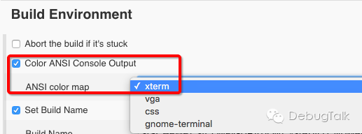
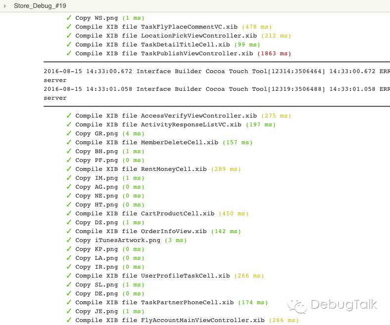
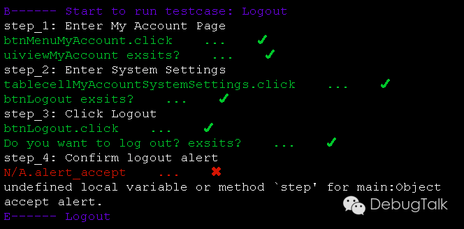

在《[使用Jenkins实现持续集成构建检查](/post/Jenkins-CI-Automation-Test/)》一文中，写到了这么一段话：

> 在这里，我们还可以通过--disable_output_color开关将输出日志的颜色关闭。之所以实现这么一个功能，是因为在Jenkins中本来也无法显示颜色，但是如果还将Terminal中有颜色的日志内容输出到Jenkins中，就会出现一些额外的字符，比较影响日志的美观。

非常感谢热心的读者，及时地为我纠正了这一点。事实上，当前在Jenkins中，是可以通过安装插件来实现在输出日志中显示颜色的。

这个插件就是`AnsiColor`。

## 安装 && 配置

安装的方式很简单，【Manage Jenkins】->【Manage Plugins】，搜索`AnsiColor`进行安装即可。

安装完成后，在Jenkins Project的`Configure`页面中，`Build Environment`栏目下会多出`Color ANSI Console Output`配置项，勾选后即可开启颜色输出配置。



在`ANSI color map`的列表选择框中，存在多个选项，默认情况下，选择`xterm`即可。

保存配置后，再次执行构建时，就可以在`Console`中看到颜色输出了。

## 效果图

使用`xctool`命令编译iOS应用时，在Jenkins的`Console output`中会看到和`Terminal`中一样的颜色效果。



## 补充说明

需要说明的是，在输出日志中显示颜色，依赖于输出的日志本身。也就是说，如果输出日志时并没有`ANSI escape sequences`，那么安装该插件后也没有任何作用，并不会凭空给日志加上颜色。

例如，如果采用`xcodebuild`命令编译iOS应用，那么输出日志就不会显示颜色。

说到这里，再简单介绍下`ANSI escape sequences`。

## ANSI escape sequences

[`ANSI escape sequences`](https://en.wikipedia.org/wiki/ANSI_escape_code)，也叫`ANSI escape codes`，主要是用于对Terminal中的文本字符进行颜色的控制，包括字符背景颜色和字符颜色。

使用方式如下：

`33[字符背景颜色;字符颜色m{String}33[0m`

其中，`33[字符背景颜色;字符颜色m`是开始标识，`33[0m`是结束标识，`{String}`是原始文本内容。通过这种形式，就可以对输出的文本颜色进行控制。

具体地，字符颜色和字符背景颜色的编码如下：

字符颜色（foreground color）：30~37

- 30:黑
- 31:红
- 32:绿
- 33:黄
- 34:蓝色
- 35:紫色
- 36:深绿
- 37:白色

字符背景颜色（background color）：40~47

- 40:黑
- 41:深红
- 42:绿
- 43:黄色
- 44:蓝色
- 45:紫色
- 46:深绿
- 47:白色

需要说明的是，字符背景颜色和字符颜色并非必须同时设置，也可以只设置一项。

## 代码示例

掌握了以上概念后，我们就可以通过对打印日志的代码进行一点调整，然后就可以让输出的日志更加美观了。

以Ruby为例，在`Sting`基础类中添加一些展示颜色的方法。

```ruby
class String
  # colorization
  def colorize(color_code)
    "\e[#{color_code}m#{self}\e[0m"
  end

  def red
    colorize(31)
  end

  def green
    colorize(32)
  end

  def yellow
    colorize(33)
  end
end
```

然后，我们在打印日志时就可以通过如下方式来控制日志的颜色了。

```ruby
# 步骤执行正常，输出为绿色
step_action_desc += "    ...    ✓"
puts step_action_desc.green

# 步骤执行异常，输出为红色
step_action_desc += "    ...    ✖"
puts step_action_desc.red
```

展示效果如下图所示。



是不是好看多了？
