在《测试工程师的自我修养--理解WebService》一文中，`52test.org`对WebService的概念及其相关名词进行了阐述，并引入了一个测试案例：[天气预报WebService服务](
http://webservice.webxml.com.cn/WebServices/WeatherWebService.asmx)。

> 作为测试人员的你，假设现在接到一个测试任务，需要对WeatherWebService中的`getWeatherbyCityName`接口进行性能测试。
> 而开发人员只给你提供了WeatherWebService的WSDL的URL链接（ http://webservice.webxml.com.cn/WebServices/WeatherWebService.asmx?WSDL  ），然后啥也没说就消失不见了。
> 那么，采用测试工具LoadRunner该怎样对指定接口进行测试呢？

本文将围绕如上测试需求，对LoadRunner基于WSDL的WebService测试方法进行详细介绍。需要说明的是，本文只针对测试脚本的开发展开描述，对测试场景的设计暂不进行讨论。

本文中采用的LoadRunner版本为V11.0，不同版本可能会存在一定差异。

## 选择Web Services协议

采用Loadrunner测试WebService时，在单协议里面选择Web Services即可。当然，这并不意味着Loadrunner测试WebService只能采用Web Services协议，在后续的文章中将向大家介绍如何通过HTTP协议来测试WebService。

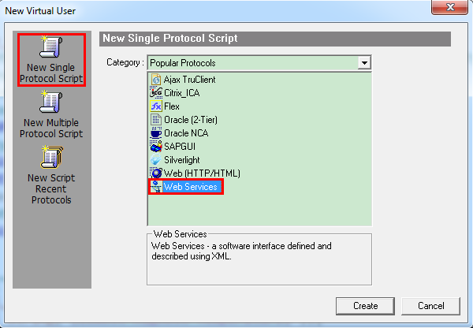

## 导入WebService的描述信息WSDL

WSDL 是基于 XML 的用于描述 WebService 以及如何访问 WebService 的语言，它对具体的 WebService 进行了描述，规定了服务的位置，以及此服务所提供的操作（或方法，或服务调用接口API）。如果你熟悉WSDL的文档结构，可以直接阅读WSDL获取相关信息。

然而，当你尝试直接去阅读WSDL文档时，你会发现这是一件十分痛苦的事情，毕竟WSDL的设计出发点是供程序阅读的，其文档结构对人员的阅读体验不是很好。

值得庆幸的是，采用LoadRunner测试WebService时，测试人员无需和原始的WSDL文档打交道，只需要在LoadRunner中导入WSDL后，即可对其中定义的函数接口进行调用。

导入WSDL主要采用两种方式：

- 通过WSDL的URL地址导入
- 直接导入本地WSDL文件

通过WSDL的URL地址进行导入时，操作方式如下图所示。

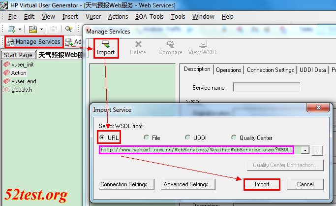

需要说明的是，填写的URL地址末尾必须包含`?WSDL`。换句话说，只有在以`?WSDL`结尾时才能对应到WSDL文件的路径。大家可以在浏览器中对WSDL的URL地址进行访问，查看WSDL当前是否有效。

如果选择直接导入本地WSDL文件的方式，则需要先将WebService对应的WSDL文件下载至本地。下载时，只需将WebService的地址末尾加上 "?WSDL" 后在浏览器中进行访问，然后对网页进行保存时将文件另存为".wsdl"的文件即可。如下图所示。

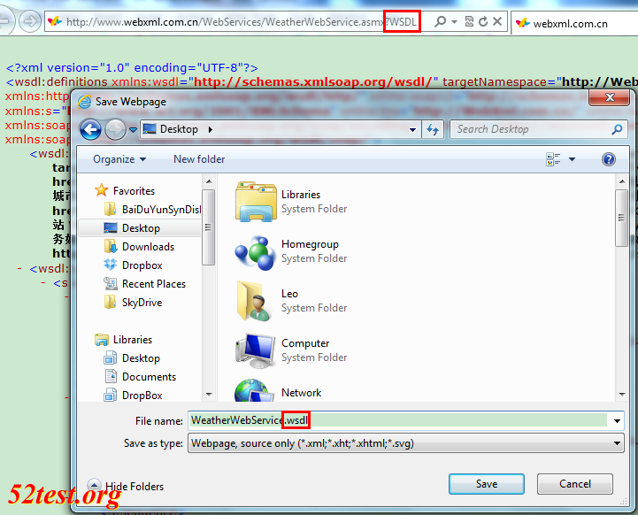

获取到WSDL文件以后，便可在LoadRunner中以文件的进行导入，操作方式如下图所示。

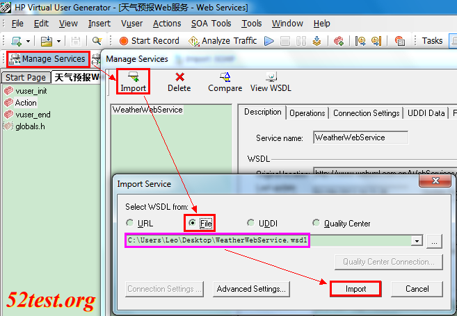

两种导入方式效果都是一样的，采用任意一种方式都能将WebService的描述信息导入至LoadRunner供其调用。

当然，两种导入方式也存在一定的差异。

- 采用**Import URL**的方式可以方便本地获取到最新的WebService描述，当远程服务器端的WebService发生变动以后，本地端可直接对WSDL进行更新，而不需对WSDL进行重新导入。在LoadRunner中，甚至可以通过设置使LoadRunner每次打开脚本的时候自动更新WSDL，如下图所示。


- 采用**Import File**方式的优点在于，可以对下载到本地的WSDL文件进行手工编辑后再使用；而缺点则是无法获取到最新的WebService的描述信息，若要更新则需重新下载WSDL文件并重新导入。

明白了两种导入方式的特点之后，大家可以根据实际需求进行选择。

## 查看WebService服务接口

在成功导入WSDL以后，在【Operation】栏目下即可看到所有可供调用的接口。值得注意的是，在本测试案例中，每个接口均包含2个`Port Name`，这是因为该WebService为每个服务接口提供了SOAP1.1和SOAP1.2两个版本的SOAP调用方式。

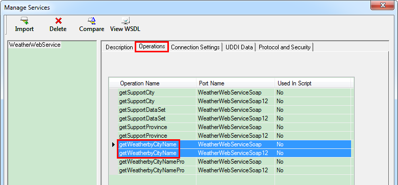

对比下图可知，这和网页上展示的接口是一致的。

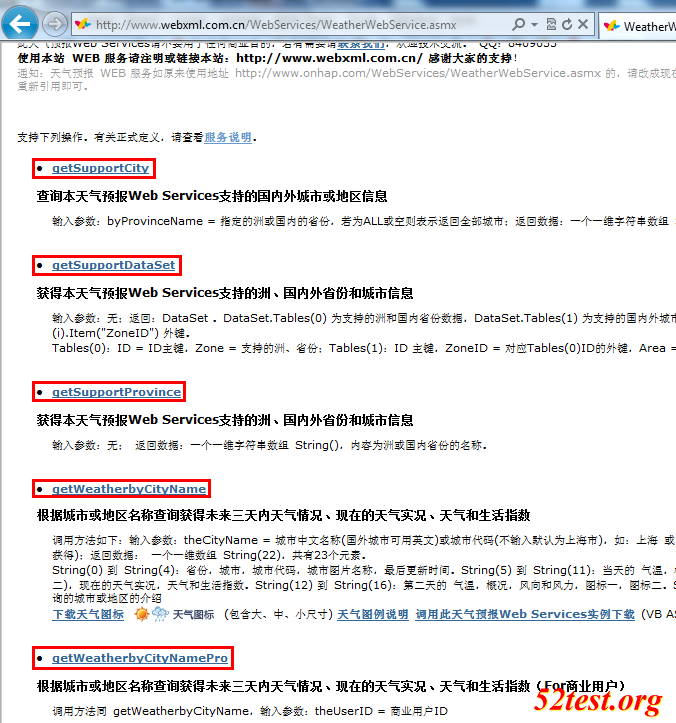

## 创建调用函数web_service_call

在LoadRunner中导入WSDL之后，便可以对WebService接口进行调用。

LoadRunner提供的调用函数为web_service_call。调用该函数时，可以根据其说明文档直接在Editor里面进行编辑，不过更简单且更不易出错的方式还是通过【Add Service Call】进行可视化编辑。帮助文档里对此也有进行说明。

>_ web_service_call is a high-level function that lets you modify all the SOAP arguments intuitively. Because editing the arguments is likely to be error-prone, it is recommended that the function be modified in the tree view of Service Test rather than in the script editor._

点击【Add Service Call】后进入Web Service Call的可视化编辑界面，如下图所示。

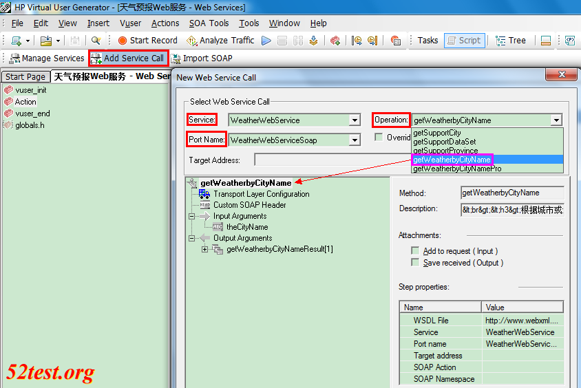

在【Add Service Call】的可视化界面中，对所需调用的Service、Port Name和Operation进行选择。在Operation列表中，可以看到存在5个可供调用的方法，对于每一个Operation，在Port Name下拉框中均可以选择WeatherWebServiceSoap和WeatherWebServiceSoap12，这和上一步骤在【Operations】中查看到的完全一致。

根据本文首部的测试需求，我们在Operation中选择接口getWeatherbyCityName；而由于开发人员未交代SOAP版本信息，因此我们需要对两个版本分别进行测试；在这里我们先选择WeatherWebServiceSoap。

在【Add Service Call】的可视化界面中可以看出，接口getWeatherbyCityName只有一个输入参数，即theCityName。而该接口则是通过城市名来获取指定城市的天气预报信息。

因此，使用getWeatherbyCityName函数接口时我们需对其传入参数theCityName。具体操作时，选中Input Arguments中的参数名theCityName，勾选其右侧的“Include argument in call”，在Value中输入城市名称即可，此处我们输入的是“广州”，如下图所示。

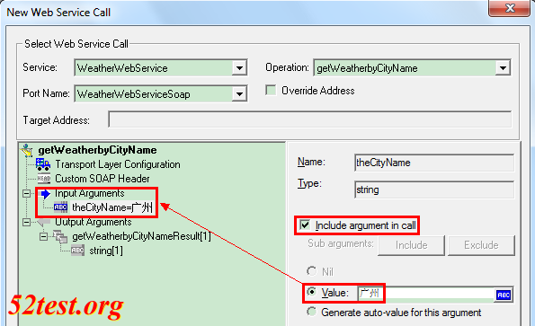

若需要调用getWeatherbyCityName函数的返回结果，则需要事先将其返回结果保存至参数里面。具体操作时，选中Output Arguments中的参数名getWeatherbyCityNameResult[1]，勾选其右侧的“Save returned value in parameter”，在Parameter中输入参数名即可。如下图所示。

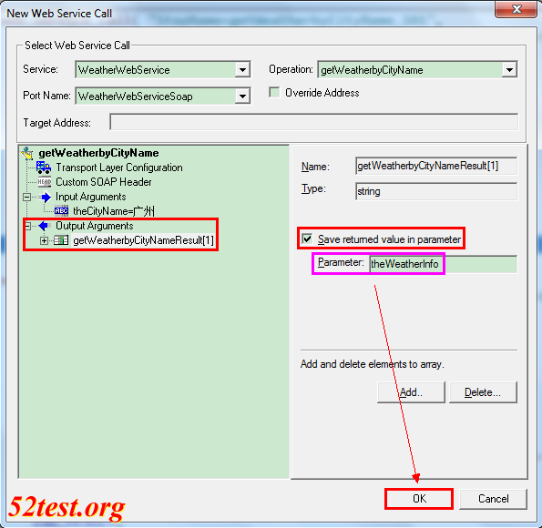

完成对Input Arguments和Output Arguments的设置后，点击【OK】按钮，便可看见脚本中新增了一个web_service_call函数，如下图所示。

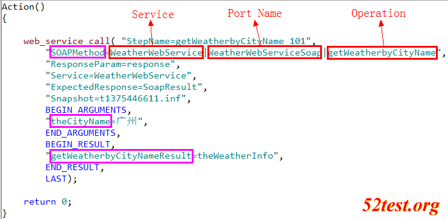

通过上图可知，之前我们在可视化界面的所有设置均已转换至web_service_call函数。

## 回放脚本，查看结果
在“Run-time Settings”中打开日志“Extended log”，勾选“Parameter substitution”和“Data  returned by server”。运行脚本后，查看“Replay Log”，如下图所示。


详细结果如下所示。

```xml
theWeatherInfo = <getWeatherbyCityNameResult XmlType="DynamicParameter"><string>广东</string><string>广州</string><string>59287</string><string>59287.jpg</string><string>2013-8-2 21:50:12</string><string>24℃/30℃</string><string>8月3日 大雨转中雨</string><string>无持续风向微风</string><string>9.gif</string><string>8.gif</string><string>今日天气实况：气温：26℃；风向/风力：东风 2级；湿度：96%；空气质量：优；紫外线强度：弱</string><string>穿衣指数：热，适合穿T恤、短薄外套等夏季服装。\n过敏指数：极不易发，无需担心过敏，可放心外出，享受生活。\n运动指数：较不宜，有较强降水，请在室内进行休闲运动。\n洗车指数：不宜，今天有雨，雨水和泥水会弄脏爱车。\n晾晒指数：不宜，有较强降水会淋湿衣物，不适宜晾晒。\n旅游指数：较不宜，有强降雨，建议您最好还是在室内活动。\n路况指数：湿滑，路面湿滑，车辆易打滑，减慢车速。\n舒适度指数：较不舒适，白天有雨，气温较高，闷热。\n空气污染指数：优，气象条件非常有利于空气污染物扩散。\n紫外线指数：弱，辐射较弱，涂擦SPF12-15、PA+护肤品。</string><string>25℃/32℃</string><string>8月4日 阵雨转晴</string><string>无持续风向微风</string><string>3.gif</string><string>0.gif</string><string>25℃/34℃</string><string>8月5日 晴</string><string>无持续风向微风</string><string>0.gif</string><string>0.gif</string><string>广州是广东省的省会,是中国南方最大的海滨城市，广州位于东经113。17`，北纬23。8`，地处中国大陆南部，广东省南部，珠江三角洲北缘。广州临南海，邻近香港特别行政区，是中国通往世界的南大门，广州属丘陵地带。中国的第三大河----珠江从广州市中心穿流而过。广州是一座历史文化名城。相传在远古时候，曾有五位仙人，身穿五色彩服、骑着嘴衔稻穗的五色仙羊降临此地，把稻穗赠给百姓，祝愿这里永无饥荒。从此，广州便有“羊城”、“穗城”的美称，“五羊”也成为广州的象征。广州既是中国也是世界名城，又是一座古城，因历史上有五羊仙子降临献稻穗的故事，广州又称为“羊城”和“穗城”，简称“穗”；广州一年四季如春、繁花似锦，除夕迎春花市闻名海内外，故又有“花城”的美誉。广州地处低纬,属南亚热带季风气候区。地表接受太阳辐射量较多，同时受季风的影响,夏季海洋暖气流形成高温、高湿、多雨的气候；冬季北方大陆冷风形成低温、干燥、少雨的气候。年平均气温为21.4-21.9度，年降雨量平均为1623.6-1899.8mm，北部多于南部。1982年，广州被国务院选定为全国首批历史文化名城之一，是我国重点旅游城市。1999年1月，广州被评为优秀旅游城市。景观：白云山、莲花山、南海神庙、佛山祖庙、广州动物园等。</string></getWeatherbyCityNameResult>
```

在浏览器访问该WebService，查询“广州”时得到结果如下图所示。

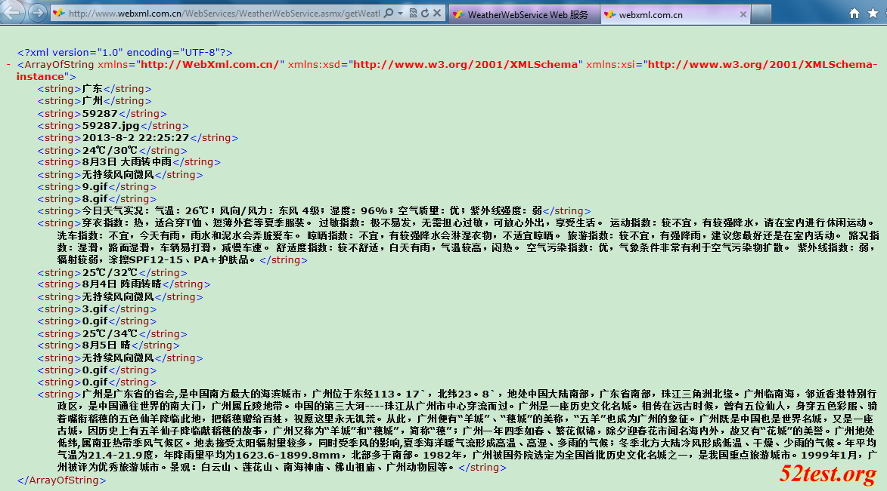

通过对比LoadRunner的Replay Log和浏览器的返回页面可知，LoadRunner对Web Service进行了正确的调用。

## 完善脚本

脚本虽已调试成功，可以得到正确的结果。但若要进行性能测试，我们还需对脚本进行参数化，如下图所示。

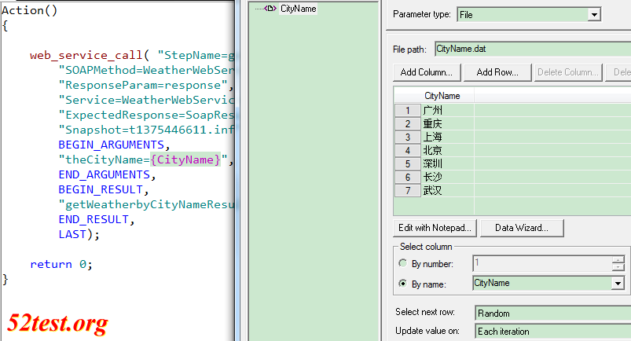

或者，如果我们是只想利用返回报文的一小部分，而不是全部。在这种情况下，我们可以指定将某部分保存至参数，以便后续的使用。

例如，我们只想获得某个城市当天的最低温度和最高温度。通过返回报文可知，该字段是输出结果中的第6个字段。那么，我们便可以将该字段保存至一个参数，这里指定为Lowest_Highest_Temperature，如下图所示。

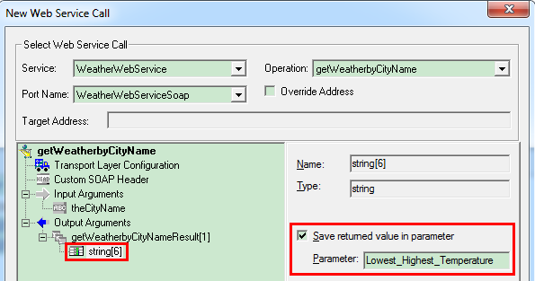

生成脚本如下所示：

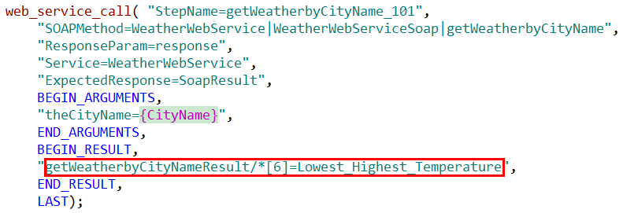

运行结果如下图所示。


当然，此处只是列举了一个简单的例子。通过对web_service_call函数的灵活应用，可以实现更多复杂、强大的功能。
